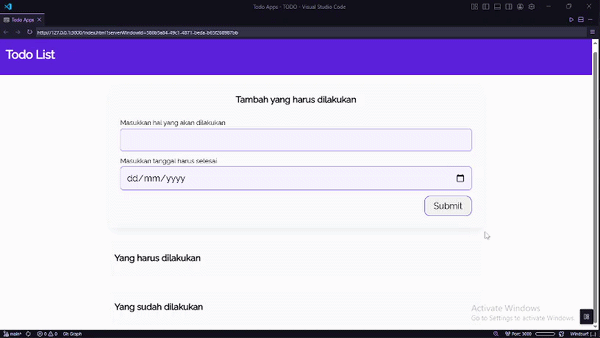
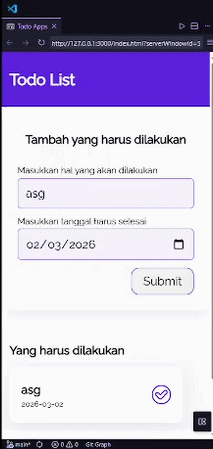

<div align="center">

# ✅ Todo Apps — Catat & Kelola Tugasmu!

[](.)
[](.)
[](.)

**Aplikasi todo list interaktif dengan fitur localStorage — data tersimpan meski browser ditutup.**

[🔗 Lihat Repo](https://github.com/Rofiq354/TODO)

</div>

---

## 📸 Preview

|            🖥️ Desktop             |            📱 Mobile            |
| :-------------------------------: | :-----------------------------: |
|  |  |

---

## ✨ Tentang Project

Todo Apps adalah aplikasi manajemen tugas berbasis vanilla JavaScript yang menerapkan konsep **Custom Event**, **DOM Manipulation**, dan **Web Storage API**. Setiap todo yang ditambahkan akan otomatis tersimpan di `localStorage` sehingga data tetap ada meskipun halaman di-refresh atau browser ditutup.

---

## 🛠️ Tech Stack

| Teknologi                                                                                                | Fungsi                      |
| -------------------------------------------------------------------------------------------------------- | --------------------------- |
|                  | Struktur halaman            |
|                     | Styling & responsif         |
|  | Logic, DOM & localStorage   |
| **Google Fonts**                                                                                         | Font Raleway                |
| **localStorage**                                                                                         | Penyimpanan data di browser |

---

## 📋 Fitur

- **Tambah Todo** — input judul task dan tanggal deadline
- **Tandai Selesai** — pindahkan todo ke daftar "sudah dilakukan"
- **Undo** — kembalikan todo yang sudah selesai ke daftar aktif
- **Hapus Todo** — hapus permanen todo yang sudah selesai
- **Persistent Storage** — data tersimpan di localStorage, tidak hilang saat refresh
- **Dua Kolom** — tampilan terpisah antara todo aktif & yang sudah selesai
- **Responsif** — tampil baik di desktop maupun mobile

---

## 📁 Struktur File

```
TODO/
├── index.html        # Struktur halaman
├── css/
│   └── style.css     # Styling aplikasi
├── js/
│   └── script.js     # Logic todo & localStorage
└── assets/           # Icon SVG (check, trash, undo)
    ├── check-outline.svg
    ├── check-solid.svg
    ├── trash-outline.svg
    ├── trash-fill.svg
    └── undo-ouline.svg
```

---

## 🚀 Cara Menjalankan

```bash
git clone https://github.com/Rofiq354/TODO.git
cd TODO
```

Buka `index.html` di browser — langsung jalan tanpa instalasi apapun!

---

## 🧠 Yang Dipelajari

```javascript
// Custom Event untuk re-render UI
const RENDER_EVENT = "render-todo";
document.dispatchEvent(new Event(RENDER_EVENT));

// Menyimpan data ke localStorage
localStorage.setItem(STORAGE_KEY, JSON.stringify(todos));

// Membaca data dari localStorage
const data = JSON.parse(localStorage.getItem(STORAGE_KEY));
```

Project ini fokus pada pemahaman konsep:

- **Custom Events** — `dispatchEvent` & `addEventListener` untuk komunikasi antar fungsi
- **localStorage API** — menyimpan, membaca, dan parsing data JSON di browser
- **DOM Manipulation** — membuat elemen dinamis tanpa framework
- **Event-Driven Architecture** — render UI dipicu oleh event, bukan dipanggil langsung

---

<div align="center">

_Sederhana tapi penuh konsep penting — fondasi sebelum belajar React & state management 🚀_

\*by **Ainur Rofiq\***

</div>
